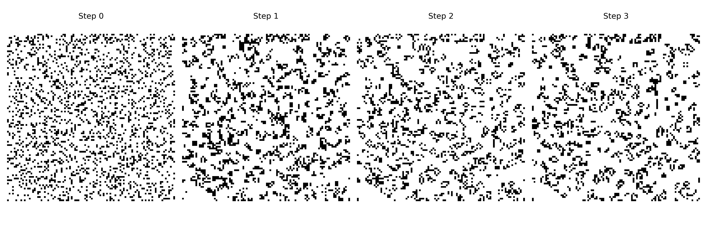
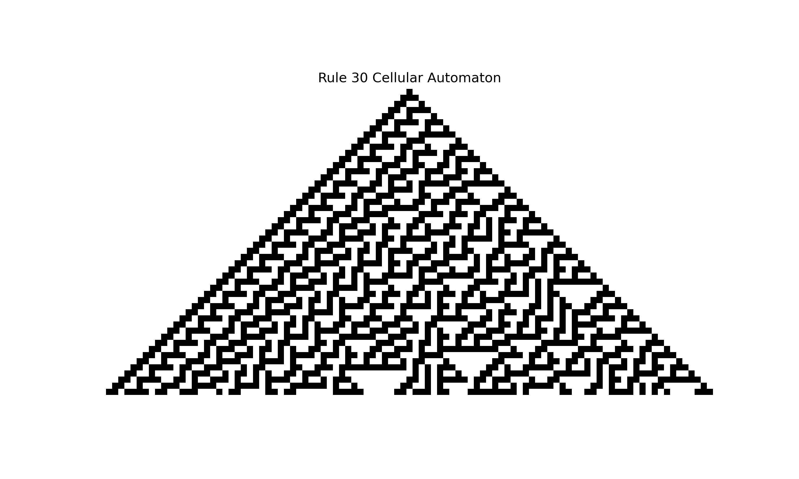

# Chapter 1: Introduction to Cellular Automata

## What Are Cellular Automata?

Cellular automata are mathematical models that consist of a grid of cells, where each cell can be in one of a finite number of states. These states evolve over time according to simple rules based on the states of neighboring cells.

### Components of Cellular Automata:

### Key Concepts

Here are some fundamental concepts in cellular automata:

*   
*   **Neighbourhood:** The set of cells surrounding a given cell that influence its state during each time step. Common neighbourhoods include the Moore neighbourhood (8 surrounding cells) and the von Neumann neighbourhood (4 directly adjacent cells).
*   **Update Rule:** The rule that governs how the state of each cell changes based on its current state and the states of its neighbours. These rules can be deterministic or probabilistic.
*   **Emergent Behaviour:** The complex patterns and dynamics that arise from the repeated application of local rules to the CA grid. These patterns are often unpredictable and can be surprisingly intricate, even for simple rule sets.


1. **Cells:** The fundamental units of a CA, arranged in a regular grid. Each cell has a state, which can be binary (e.g., on/off) or take on multiple values.

2. **Grid**: The system is usually represented as a grid, which can be:
   - **1D**: A single row of cells.
   - **2D**: A grid of rows and columns (e.g., like a chessboard).
   - Higher dimensions are also possible but less common.

3. **States**: Each cell can have a state, like:
   - **Binary**: On/Off, Alive/Dead (e.g., 0 or 1).
   - **Multi-state**: A set of possible states (e.g., 0, 1, 2).

3. **Rules**: The evolution of the grid is governed by rules that:
   - Determine the next state of a cell based on its current state and the states of its neighbors.
   - These rules are often simple but can lead to complex behavior.

5. **Time Steps**: The system evolves in discrete time steps, applying the rules to all cells simultaneously.


### Why Are Cellular Automata Interesting?
- **Simple to Complex**: Even with simple rules, cellular automata can produce highly complex patterns and behaviors.
- **Applications**: They are used in:
  - **Physics**: Modeling fluid dynamics and crystal growth.
  - **Biology**: Simulating ecosystems or the spread of diseases.
  - **Computer Science**: Data compression and cryptography.
  - **Art**: Generating patterns and procedural designs.

### Example 01_01: Conway’s Game of Life
- **Grid**: 2D grid.
- **States**: Each cell is either alive (1) or dead (0).
- **Rules**:
  1. A live cell with 2 or 3 live neighbors stays alive.
  2. A dead cell with exactly 3 live neighbors becomes alive.
  3. All other cells die or stay dead.
- Despite these simple rules, it produces surprisingly complex and lifelike patterns.

```
import numpy as np
import matplotlib.pyplot as plt

# Constants
N = 100  # Grid size
ON = 255  # Value for live cells
OFF = 0  # Value for dead cells
NUM_SNAPSHOTS = 4  # Number of snapshots to display
OUTPUT_FILENAME = "game_of_life_snapshots.png"  # File name for the PNG

# Initialize grid with random on/off values
def initialize_grid(size, on_prob=0.2):
    return np.random.choice([ON, OFF], size * size, p=[on_prob, 1 - on_prob]).reshape(size, size)

# Compute the next state of the grid
def update_grid(grid):
    new_grid = grid.copy()
    for i in range(N):
        for j in range(N):
            # Compute the sum of the 8 neighbors using toroidal boundary conditions
            neighbors = (
                grid[i, (j - 1) % N] + grid[i, (j + 1) % N] +
                grid[(i - 1) % N, j] + grid[(i + 1) % N, j] +
                grid[(i - 1) % N, (j - 1) % N] + grid[(i - 1) % N, (j + 1) % N] +
                grid[(i + 1) % N, (j - 1) % N] + grid[(i + 1) % N, (j + 1) % N]
            ) / 255

            # Apply Conway's rules
            if grid[i, j] == ON:
                if neighbors < 2 or neighbors > 3:
                    new_grid[i, j] = OFF
            else:
                if neighbors == 3:
                    new_grid[i, j] = ON
    return new_grid

# Generate multiple snapshots of the grid
def generate_snapshots(grid, num_steps):
    snapshots = [grid]
    for _ in range(num_steps - 1):
        grid = update_grid(grid)
        snapshots.append(grid)
    return snapshots

# Plot snapshots side by side and save as PNG
def plot_snapshots(snapshots, output_filename=None):
    num_snapshots = len(snapshots)
    fig, axes = plt.subplots(1, num_snapshots, figsize=(15, 5))

    for i, ax in enumerate(axes):
        ax.matshow(snapshots[i], cmap="binary")
        ax.set_title(f"Step {i}")
        ax.axis("off")

```



**The beauty of cellular automata lies in their ability to generate emergent behavior, where complex patterns and dynamics arise from the repeated application of these simple local rules.** These emergent patterns can mimic real-world phenomena like crystal growth, fluid dynamics, and even biological systems.


### Types of Cellular Automata

There are various types of cellular automata, each with unique characteristics and applications:

*   **Elementary Cellular Automata (ECA):** The simplest class of CA with a one-dimensional grid, two possible cell states, and rules based on the state of the cell and its two immediate neighbours.
*   **Continuous Cellular Automata:** CA where cell states can take on continuous values, allowing for smoother transitions and more nuanced behaviour. Lenia is a notable example of this type.
*   **Neural Cellular Automata (NCA):** A more recent development where the update rules are implemented using artificial neural networks. This integration allows NCAs to learn and adapt their behaviour based on data, enabling them to solve complex tasks like image recognition, shape generation, and even control problems.


### Potential Applications

*   **Modelling Complex Systems:** CA can simulate a wide range of natural phenomena, including crystal growth, fluid dynamics, traffic flow, and biological processes. This ability makes them valuable tools for scientific research and understanding complex systems.
*   **Pattern Generation:** The emergent behavior of CA makes them suitable for generating intricate patterns and textures. This property is exploited in computer graphics, art, and design.
*   **Image Processing:** NCAs excel at image processing tasks like de-noising, segmentation, and reconstruction. Their localised, iterative processing can be advantageous over traditional convolutional neural networks, especially in resource-constrained environments.
*   **Artificial Life:** CA are frequently used in artificial life research to study self-organisation, evolution, and emergent behaviour in simulated organisms. Lenia, for instance, has produced life-like, self-replicating patterns.
*   **Robotics and Control:** NCAs are being explored for controlling robots and other physical systems. Their ability to learn and adapt makes them promising candidates for tasks requiring robust and emergent control strategies.
*   **Environment Generation:** NCAs can be trained to generate complex and scalable environments for training and testing multi-agent systems, particularly in robotics and simulation.

The sources discuss various applications of CA, such as pedestrian flow simulation, nuclei growth, tumour growth, and evacuation process simulation. They also discuss the use of CA for image processing, 3D shape generation, and the creation of functional artefacts capable of regenerating when damaged.

**The ongoing research and development of cellular automata, particularly neural cellular automata, promise further exciting applications and insights in the future.** As computational resources continue to improve, we can expect even more sophisticated and impactful applications of this fascinating computational paradigm.


Cellular automata (CAs) are computational systems that operate on a grid of cells, where each cell transitions between states based on a set of rules. Despite their simplicity, cellular automata can produce highly complex behaviors and patterns, making them a cornerstone of studies in complexity and emergent phenomena.

### Overview and Importance

The importance of cellular automata lies in their ability to model real-world phenomena, such as:
- Biological growth
- Traffic flow
- Fluid dynamics
- Computation (e.g., Rule 110, which is Turing complete)

#### Example: A Simple 1D Cellular Automaton
```python
import matplotlib.pyplot as plt
import numpy as np

# Rule 30: A simple 1D cellular automaton
def rule_30(left, center, right):
    return (left ^ (center | right))

def generate_1d_ca(rule, size, steps):
    grid = np.zeros((steps, size), dtype=int)
    grid[0, size // 2] = 1  # Start with a single cell in the middle

    for t in range(1, steps):
        for i in range(1, size - 1):
            grid[t, i] = rule(grid[t-1, i-1], grid[t-1, i], grid[t-1, i+1])
    
    return grid

# Generate and visualize Rule 30
size = 101
steps = 50
grid = generate_1d_ca(rule_30, size, steps)

plt.figure(figsize=(10, 6))
plt.imshow(grid, cmap="binary")
plt.title("Rule 30 Cellular Automaton")
plt.axis("off")
plt.show()
```



This example implements **Rule 30**, a simple 1D cellular automaton that creates a chaotic pattern from a single starting cell.

---

## Why Cellular Automata for Programmers?

Cellular automata are not only theoretical constructs but also practical tools for solving real-world problems. For programmers, they offer a sandbox to experiment with rule-based systems, pattern formation, and decentralized decision-making.

### Practical Applications in Programming
1. **Modeling**: CAs are widely used in simulations (e.g., ecosystem dynamics, disease spread).
2. **Optimization**: CAs can solve problems like pathfinding and resource allocation.
3. **Generative Design**: Used in procedural content generation for games and art.
4. **Data Processing**: Applications in compression, cryptography, and noise reduction.

#### ## Example 03 - Traffic Flow Simulation using the Nagel-Schreckenberg Model

```python
# Import necessary libraries
import numpy as np
import matplotlib.pyplot as plt
from matplotlib import animation
from IPython.display import HTML


# Simulation parameters
road_length = 100         # Length of the road (number of cells)
num_cars = 30             # Number of cars on the road
max_speed = 5             # Maximum speed of cars (cells per time step)
p_slow = 0.3              # Probability of random slowing down
num_steps = 100           # Number of time steps to simulate

# road: An array representing the road where -1 indicates an empty cell.
# Initialize the road with empty cells (-1)
road = np.full(road_length, -1)

# Randomly place cars on the road with random initial speeds
car_positions = np.random.choice(road_length, num_cars, replace=False)
# Random initial speeds assigned to each car.
initial_speeds = np.random.randint(0, max_speed+1, num_cars)
road[car_positions] = initial_speeds


def update_road(road):
    new_road = np.full_like(road, -1)
    road_length = len(road)
    for i in range(road_length):
        if road[i] != -1:
            speed = road[i]
            # Step 1: Acceleration
            if speed < max_speed:
                speed += 1
            # Step 2: Slowing down due to other cars
            distance = 1
            while distance <= speed and road[(i + distance) % road_length] == -1:
                distance += 1
            distance -= 1
            speed = min(speed, distance)
            # Step 3: Randomization
            if speed > 0 and np.random.rand() < p_slow:
                speed -= 1
            # Step 4: Move the car
            new_position = (i + speed) % road_length
            new_road[new_position] = speed
    return new_road

# Store the history of the road for visualization
road_history = [road.copy()]
for step in range(num_steps):
    road = update_road(road)
    road_history.append(road.copy())


# Prepare the figure
fig, ax = plt.subplots(figsize=(12, 6))
ax.set_xlabel('Position on Road')
ax.set_ylabel('Time Step')

# Convert road history to a 2D array for visualization
road_display = []
for state in road_history:
    display_state = np.where(state >= 0, 1, 0)  # 1 for car, 0 for empty
    road_display.append(display_state)
road_display = np.array(road_display)

# Display the simulation as an image
im = ax.imshow(road_display, cmap='Greys', interpolation='none', aspect='auto')

print("""Explanation: We create a 2D array where rows represent time steps and columns represent positions on the road. 
         A value of 1 indicates a car, and 0 indicates an empty cell. 
         We then use imshow to display this array as an image.""")

# Show the plot
plt.show()

print("""Explanation: We use FuncAnimation from matplotlib.animation to create an animation. 
      At each frame, we display the state of the road at that time step.""")

# Create an animated visualization
fig, ax = plt.subplots(figsize=(12, 6))

def animate(i):
    ax.clear()
    ax.imshow([road_display[i]], cmap='Greys', aspect='auto')
    ax.set_title(f'Time Step {i}')
    ax.set_xlabel('Position on Road')
    ax.set_yticks([])

anim = animation.FuncAnimation(fig, animate, frames=num_steps, interval=200)
plt.close()
HTML(anim.to_jshtml())

```

This simple traffic flow model simulates how cars move along a circular road.

### Cellular Automata as a Tool for Innovation

Cellular automata encourage thinking about problems in terms of local interactions rather than global rules, making them particularly powerful in:
- Decentralized systems (e.g., swarm robotics)
- Generative algorithms (e.g., fractals and patterns)
- Parallel computation (e.g., GPU-based CA systems)

---


### Conclusion

This chapter introduced cellular automata, their significance, and their potential for innovation in programming. It also outlined the foundational knowledge and tools required to start developing cellular automata systems. In the next chapter, we will implement our first cellular automaton and explore its behavior in Python.

--- 

